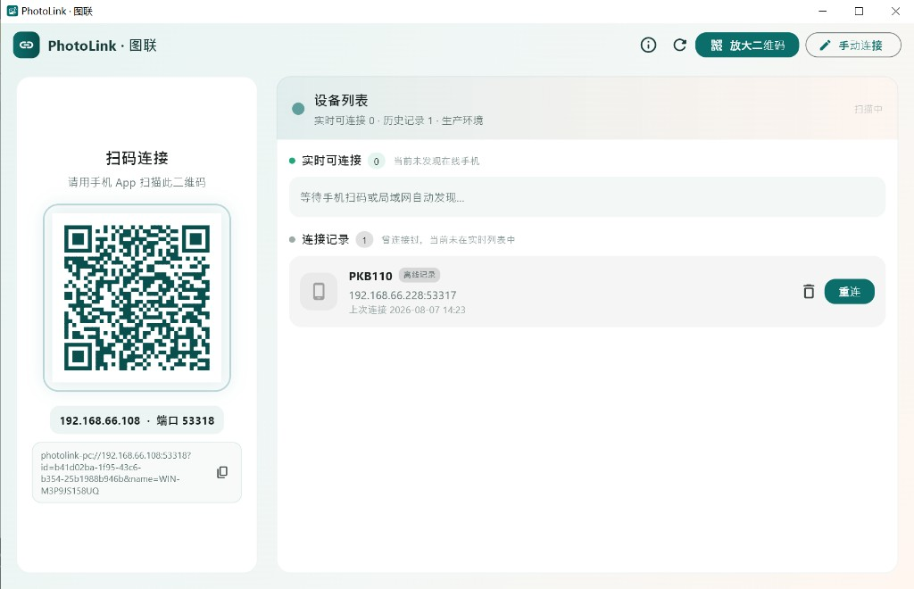
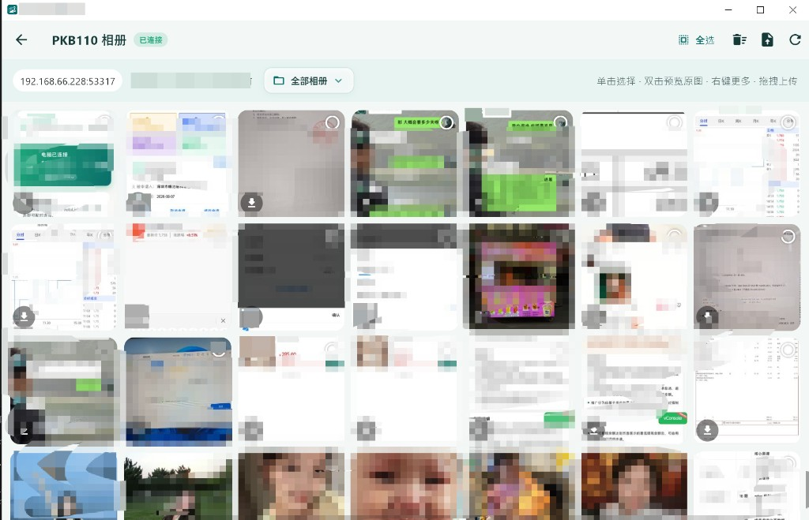

# PhotoLink · 图联（电脑端）

局域网相册互联工具的 **桌面端**（Windows / macOS）。自动发现或接收手机配对，浏览手机相册，支持下载、软删（回收站）、重命名归类、拖拽上传；并广播本机配对服务，供手机主动搜索连接。

> 配套手机端仓库：[photolink-app](https://github.com/yu-hong-quan/photolink-app)

---

## 下载安装（v1.1.3 · prod）

| 端 | 文件 | 说明 |
|----|------|------|
| **Windows 电脑端** | [⬇️ PhotoLink-Setup-1.1.1-prod.exe](./releases/PhotoLink-Setup-1.1.1-prod.exe) | Windows Setup（当前安装包图标仍为旧版；源码图标已去白边，需在 Windows 上重跑安装包脚本） |
| **macOS 电脑端** | [⬇️ PhotoLink-1.1.4-prod-macos.dmg](./releases/PhotoLink-1.1.4-prod-macos.dmg) | macOS 磁盘镜像（已去白边） |
| **Android 手机端** | [⬇️ PhotoLink-1.1.1-prod-arm64.apk](https://github.com/yu-hong-quan/photolink-app/releases/download/v1.1.1/PhotoLink-1.1.1-prod-arm64.apk) | Android APK（公开包仍为 v1.1.1；源码图标已去白边，需本机有 Android SDK 后重打 APK） |
| **iOS 手机端** | — | **暂无公开安装包**（见下方说明） |

> 手机与电脑必须使用同一环境（本安装包均为 **prod**）。  
> Windows 默认目录：`C:\Program Files\PhotoLink`（安装路径支持中文）。  
> 电脑端若网页无法直下，可打开 [`releases`](./releases/) 目录 → 点击文件 → `Download` / `View raw`。  
> **Mac + Android 可以互联**（同一 Wi‑Fi、同一 FLAVOR 即可），不依赖 Windows。

### macOS 安装说明（未公证）

当前 DMG **未做 Apple 公证**，首次打开可能被系统拦截：

1. 打开 DMG，将 `PhotoLink.app` 拖到「应用程序」
2. 若提示「无法验证开发者」：右键 App → **打开** → **仍要打开**
3. 或：系统设置 → 隐私与安全性 → **仍要打开**
4. 可选（终端）：`xattr -cr /Applications/PhotoLink.app`

### iOS 说明（为何没有公开包）

苹果不允许像 Android APK 那样把 IPA 挂到 GitHub 供任意人下载安装。可选方式：

- **日常使用**：请用 **Android APK** + Windows / macOS 电脑端
- **自己编译安装**：在 Mac 上用 Xcode / `flutter run` 对本机 iPhone 签名安装（免费 Apple ID 约 7 天需重签）
- **后续**：若开通 Apple Developer 与 TestFlight，再提供测试链接（仍不是 GitHub 直链 IPA）

---

## 界面预览

### 设备列表与扫码配对

左侧展示配对二维码与连接串，右侧为实时可连接设备与连接记录；支持放大二维码、手动连接、刷新扫描。



### 手机相册浏览

连接成功后进入相册：缩略图网格、已连接状态、相册筛选；支持选择、下载、上传、拖拽上传与原图预览。



---

## 功能概览

| 能力 | 说明 |
|------|------|
| 发现手机 | mDNS 发现局域网内 PhotoLink 手机；启动时自动多轮扫描 |
| 配对服务 | HTTPS 配对口 + 二维码；接收手机回传地址后**自动连接相册** |
| 被手机搜索 | mDNS 广播 `deviceType=pc`，手机可主动搜到本机 |
| 相册浏览 | 懒加载缩略图、原图预览、分页加载 |
| 传输 | 下载原图、拖拽 / 选择文件上传到手机 |
| 回收站 | 移入回收站、恢复、彻底删除（与手机端软删联动） |
| 设备历史 | 连接记录持久化；同设备保留最近一条 |
| 系统托盘 | 关闭进托盘；托盘菜单显示 / 隐藏 / 退出 |
| 关于作者 | AppBar「关于」查看版本、环境、作者信息 |

---

## 环境要求

- Flutter SDK（与项目 `pubspec.yaml` 的 SDK 约束一致）
- Windows 10+ 或 macOS（桌面启用）
- 与手机同一 Wi‑Fi（关闭路由器 AP 隔离更稳）
- **电脑与手机必须使用同一运行环境（FLAVOR）**
- Windows 防火墙放行配对端口与出站访问手机相册端口

---

## 三套环境

通过 `--dart-define=FLAVOR=local|test|prod` 切换。

| FLAVOR | 说明 | 相册端口（连手机） | 本机配对端口 |
|--------|------|--------------------|--------------|
| `local` | 本地开发 | 53337 | 53338 |
| `test` | 测试 | 53327 | 53328 |
| `prod` | 生产（默认） | 53317 | 53318 |

---

## 快速开始

```bash
flutter pub get

# Windows 本地环境
flutter run -d windows --dart-define=FLAVOR=local
# 或
.\scripts\run-windows.ps1 -Env local

# macOS
./scripts/run-macos.sh local
```

首次完整运行建议用 `flutter run`（热重载可能无法生效托盘 / 窗口初始化相关改动）。

---

## 打包

### Windows（绿色目录）

```bash
.\scripts\build-windows.cmd prod
# 或
.\scripts\build-windows.ps1 -EnvName test
```

产物目录：`build/windows/x64/runner/Release/`  
分发时请拷贝**整个 Release 目录**（含 `photolink_pc.exe` 与同目录 DLL）。

### Windows 安装包（Inno Setup）

依赖：本机安装 [Inno Setup 6](https://jrsoftware.org/isinfo.php)（需带简体中文语言包）。

```bash
.\scripts\build-windows-installer.cmd local
# 或
.\scripts\build-windows-installer.ps1 -EnvName prod
```

产物：`dist/installer/PhotoLink-Setup-{version}-{env}.exe`  
- 安装向导为**简体中文**
- **安装路径支持中文**（可在向导中自定义，如 `D:\测试目录\图联`）
- 默认目录：`C:\Program Files\PhotoLink`（也可选当前用户安装）
- 手机端与电脑端 **FLAVOR 必须一致**

仅已有 Release、只重编 Setup 时：

```bash
.\scripts\build-windows-installer.ps1 -EnvName local -SkipFlutterBuild
```

### macOS（需在 Mac 上）

仅生成 `.app`：

```bash
./scripts/build-macos.sh prod
```

产物：`build/macos/Build/Products/Release/photolink_pc.app`

生成可分发 **DMG**（推荐上传 GitHub / `releases/`）：

```bash
./scripts/build-macos-dmg.sh prod
# 已有 .app、只重打 DMG：
./scripts/build-macos-dmg.sh prod --skip-build
```

产物：`releases/PhotoLink-{version}-{env}-macos.dmg`  
（未公证；他人安装见上文「macOS 安装说明」。）

---

## 使用说明

1. 启动电脑端，左侧出现配对二维码，右侧为设备列表（自动扫描）。
2. **连接手机（任选）**
   - 手机扫电脑二维码，或手机「搜索附近电脑」点连接 → 电脑**自动打开相册**。
   - 或在电脑列表点「连接」/ 手动输入手机 IP。
3. 相册内可预览、下载、移入回收站、重命名归类、拖拽上传。
4. 右上角刷新设备列表**不会中断**当前已打开的相册会话。
5. 点窗口关闭默认隐藏到系统托盘；托盘可「退出」。

### 多设备说明（当前版本）

- 设备列表可同时看到多台手机。
- **相册浏览一次只服务一台手机**；已在相册页时再有新配对，会写入列表但不自动再开一层。
- 一台手机协议上可被多台电脑访问；手机首页连接态以最近活跃电脑为主。

---

## 目录结构（节选）

```text
lib/
  core/           # 常量、环境 FLAVOR、设备模型
  pages/          # 设备列表、相册、回收站、关于
  services/       # mDNS 发现/广播、配对、相册 API、托盘、缓存等
  widgets/        # 懒加载缩略图、任务队列面板等
  theme/          # 主题
scripts/          # 多环境运行 / 打包 / 安装包脚本
installer/windows/# Inno Setup 安装脚本（支持中文路径）
docs/screenshots/ # README 界面截图
assets/certs/     # 自签名证书（配对 HTTPS）
assets/icons/     # 应用 / 托盘图标
```

---

## 协议要点

- mDNS：`_photolink._tcp`
  - 手机 TXT：`deviceType=phone`，port = 相册口
  - 电脑 TXT：`deviceType=pc`，port = 配对口
- 电脑连手机相册：`https://{phoneIp}:{galleryPort}/api/...`（自签名，客户端忽略证书校验）
- 手机连电脑配对：`POST https://{pcIp}:{pairPort}/api/pair`
- 配对二维码：`photolink-pc://{ip}:{pairPort}?id=...&name=...`

---

## 常见问题

**启动后看不到手机？**  
确认同一 Wi‑Fi / FLAVOR、手机 App 在前台；点刷新或等待自动二次扫描。Windows 上 Bonsoir 偶发需重扫。

**配对成功但不进相册？**  
看电脑是否弹出连接失败提示；检查手机相册端口防火墙与 App 是否在前台。

**托盘 / 图标不更新？**  
完整重启进程，不要只热重载。

**macOS 下载后打不开？**  
属未公证正常现象，见上文「macOS 安装说明」。

**iOS 能从 GitHub 下载安装吗？**  
目前不能公开分发 IPA，见上文「iOS 说明」。

---

## 作者

- 作者：余洪全（yu-hong-quan）
- GitHub：https://github.com/yu-hong-quan
- 仓库：https://github.com/yu-hong-quan/photolink-pc

---

## 许可

仅供学习与自用。二次分发或商用请自行评估证书、隐私与系统全限合规要求。
